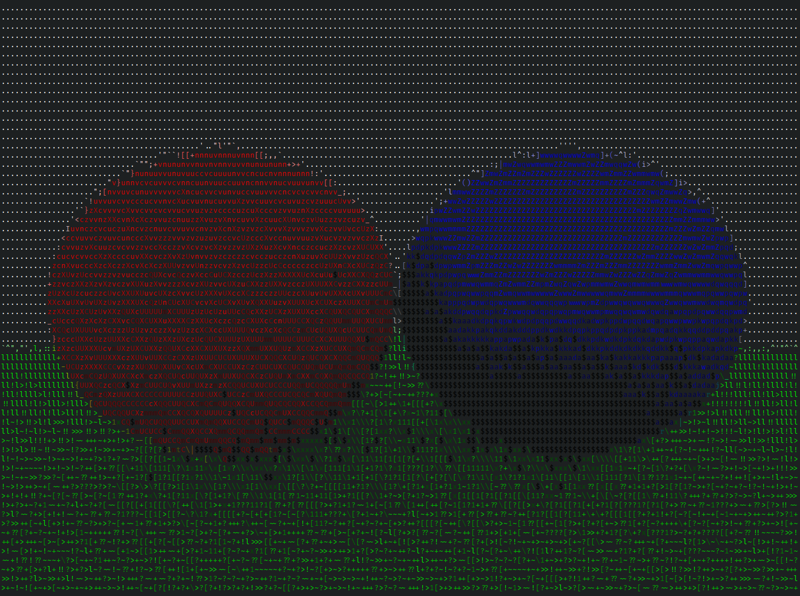

# raytrascii
ASCII ray tracing for the terminal.

This project is based on a book by [Peter Shirley](https://github.com/petershirley) that gives you a nice little introduction to ray tracing:
[_Ray Tracing in One Weekend_](https://raytracing.github.io/books/RayTracingInOneWeekend.html)
